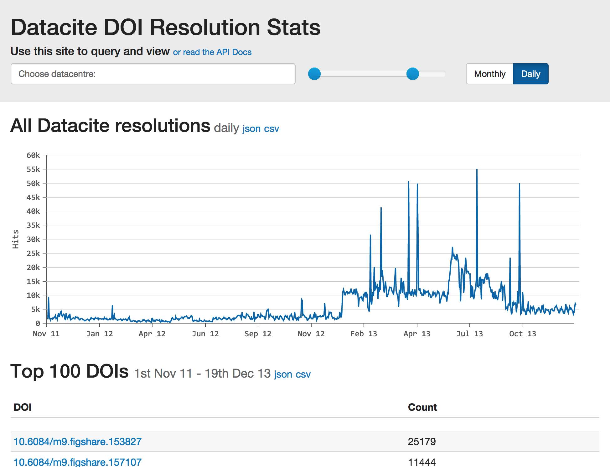

Datacite Resolution Stats
=========================

Simple application that takes DOI resolution logs provided by CNRI, parses them into mongo documents, makes them available via a RESTful interface.  Also provides a nice, clean user interface enabling users to query and view the stats.

Developed with RESTlet, Guice, Contour.js and MongoDB.

Simple mvn package up the lot into a .war file and deploy in your favourite container.  Mongo can be configured via web.xml init-params.  See GuiceConfigModule.java for parameter names.  Mongo can be swapped out by implementing the LogLoader and LogQueryResolver interfaces and making them use your favourite repository.

Screenshot
==========

API
===
The RESTful API enables daily, monthly and Top DOI queries.  Daily and monthly queries can be restricted to individual DOI prefixes and further broken down into per-DOI stats.  Results are returned in JSON (csv and XML to follow)

API Examples
--------
Return the top 100 DOIs of all time and their hit counts
`api/stats/hits?limit=100`

Return the top 1000 DOIs with the prefix 10.1234
`api/stats/hits/10.1234?limit=1000`

Return the top 1000 DOIs with the prefix 10.1234 between two dates
`api/stats/hits/10.1234?limit=1000&from=2012-01-01&to=2014-01-01`

Return daily stats for all datacite
`api/stats/daily`

Return monthly stats for all datacite
`api/stats/monthly`

Return dailystats for 10.1234
`api/stats/daily/10.1234`

Return monthly stats for 10.1234 as a MAP
`api/stats/daily/10.1234?map`

Return monthly stats for 10.1234 broken down by doi
`api/stats/daily/10.1234?breakdown=true`

Return monthly stats for 10.1234 broken down by doi between two dates
`api/stats/daily/10.1234?breakdown=true&from=2012-01-01&to=2014-01-01`

In addition, a map of DOI prefixes -> Datacentre names is provided at
`api/dois/prefixes`

Adding a ?csv param to any of the above will return **CSV**
`api/stats/hits?limit=100&from=2013-03-01&to=2014-09-01&csv`

Requirements
============
Should work with the latest java 1.7.x, mongo 2.4.x and maven 3.x

Tested with
* Java 1.7
* Maven 3.0.3
* MongoDB v2.4.5

Other dependencies are defined in the pom.xml

Configuration
=============
The app should work with the default configuration out of the box.

You can configure directly by editing the guice config in [GuiceConfigModule.java](https://github.com/TomDemeranville/datacite-stats/blob/master/src/main/java/uk/bl/datacitestats/GuiceConfigModule.java)
or by specifying the following servlet parameters in the web.xml

Mongo
-----

This app will work on a blank install of mongo. A Mongo database will be created if not already present.  

* "mongo.log.db" the db name to use (default  = dcstats)
* "mongo.log.collection"the db collection to use (default = log)
* "mongoHost" the hostname of the db (default = localhost)
* "mongoPort" the port to connect to (default = 27017)

Other
-----

* "log.root.path" the root path of a directory containing .gz log files as supplied by cnri (default = /var/datacite-stats)
* "log.ignore.ip" a collection of requestor IP addresses to ignore when parsing log files (default = empty list)
* ehcache can be configured in ehcache.xml in the resources directory.  Default is a LRU in memory cache.

The app looks in root path directory and all it's sub-directories and recursively searches for .gz files which are then examined and loaded.

Loading data (work in progress - should work)
============
POST an empty request to /admin/reload.  This will start the reload job and return HTTP 202 Accepted, if the job is already running the server will return HTTP status 102.  Once finished, GET /admin/reload will return a summary of the most recent reload job.

Issues
======

Timezone problems
-----------------

Logs are provided in UTC and EST timezones.  Mongo stores them all as UTC.  The application aggregates them as UTC.  This would not normally be a problem.

The issue is that logs provided in "monthly" blocks equate to different stretches of time!  This means over/underlaps of data at the beginning and end of the first and most recent month.  There is little we can do about this when querying but does mean the last day of the most recent month is WRONG.  Answers on a postcard.  It also makes unit testing a pain.  If it was simply a different timezone per user we could work this out, but it's not.

A further complication is that CNRI logs ommited the first 12 hours of every month throughout 2013.  Also, date formats have changed in logs since sep 2014.

Slow first request
------------------

The first request made to the server for daily or monthly overall stats is slow (roughly 30s, although it does complete).  This request is subsequently cached. This needs to be computed on log load or cached in the db so that it can be returned instantly.

TODO
----

* FIX TIMEZONE issues detailed above...
* Provide an admin servlet that fires off bulk load jobs.  Currently run via junit script.
* Live fetch (and cache in the db) datacite customer prefixes & display names.  Currently parsed from a static JSON file.  Also need to take into account multiple datacentres can share a prefix. 10.1594 is an example (and could be the only one)